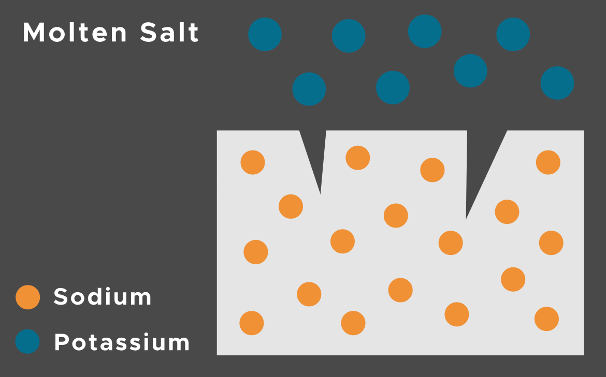
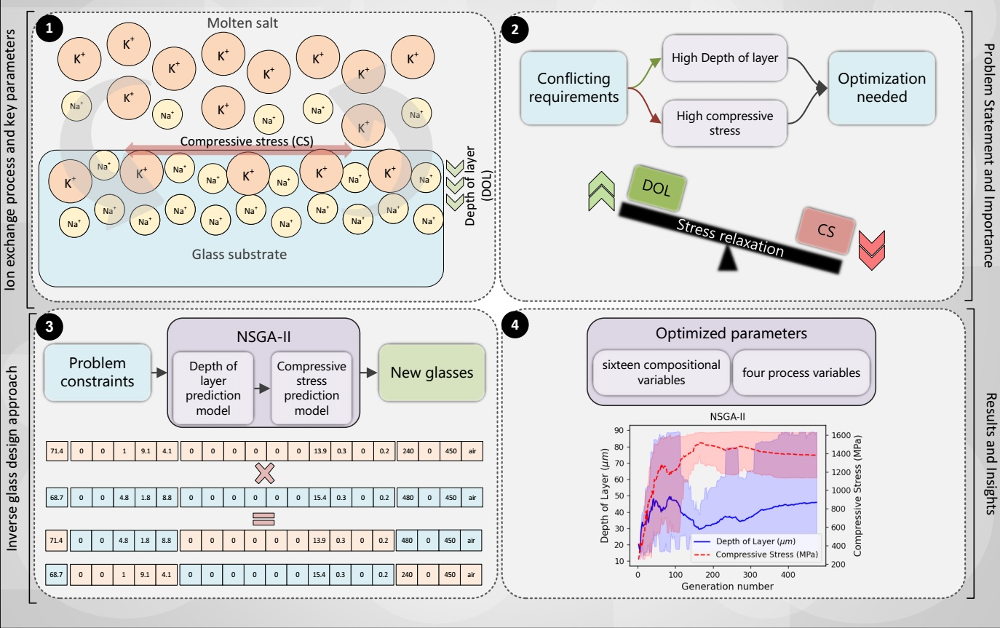

# IDMO.G

## Inverse Design and Multi-objective Optimization for Glasses

The ion exchange process entails submerging glass, characterized by a modest concentration of alkali oxides (typically 10-20 mol% Li2O and/or Na2O), into a molten salt bath containing larger alkali cations (NaNO3 for glass with Li2O or KNO3 for glass with Na2O) at an approximate temperature of 400°C. 

(All credits belong to [SAXON GLASS](https://saxonglass.com/))

In this study, we investigate the complex world of ion-exchangeable glasses, focusing on their design and the challenges that come with it. 
The main difficulty lies in trying to achieve two goals at the same time: increasing the depth of layer (DOL) and the compressive stress (CS)
within the glass. These two factors are crucial for making the glass strong and effective. However, trying to improve the DOL by either extending
the ion exchange process time or raising its temperature can unintentionally lead to stress relaxation, reducing the compressive stress (CS) on the
glass surface. This occurs because the process intended to deepen the DOL can also cause the glass to undergo stress relaxation.
Our research aims to carefully explore this delicate balance, with the goal of finding ways to optimize both the DOL and CS. 

---

The animation presented below illustrates how the NSGA-II algorithm methodically searches for optimal values of DOL (Depth of layer) and CS (Compressive stress). 

----

**[Read More](http://webpages.iust.ac.ir/omid_banapour/EF-IE.html)**

## Project contributors
* **Omid Banapour Ghaffaria** 
  * Ph.D. Candidate, School of Metallurgy and Materials Engineering, Iran University of Science and Technology
  * Email: **omid_banapour[at]metaleng.iust.ac.ir** 

* **Bijan Eftekhari Yekta** 
  * Professor, School of Metallurgy and Materials Engineering, Iran University of Science and Technology
  * Email: **Beftekhari[at]iust.ac.ir**

* **Morteza Zakeri-Nasrabadi** 
  * Postdoctoral Researcher, [School of Computer Science](https://cs.ipm.ir/), [Institute for Research in Fundamental Sciences (IPM)](https://ipm.ac.ir/),  Farmanieh Campus, No. 70, next to Kouhe Nour Building, Lavasani Av. Tehran, Iran. P. O. Box: 19395-5746 
  * Email: **zakeri[at]ipm.ir**

## Publications
[1] Banopur Ghaffari, O. , Eftekhari Yekta, B., & Zakeri-Nasrabadi, M. (2024). Estimating “depth of layer” (DOL) in ion-exchanged glasses using explainable machine learning. Materialia, 102027. [https://doi.org/10.1016/J.MTLA.2024.102027](https://doi.org/10.1016/J.MTLA.2024.102027)

## Announcement
**Release date:** The complete version of the tool will be made accessible in this repository ([https://github.com/omid-vop/IDMO.G]()) after the publication approval of our relevant research papers.

## FQA
You may ask any question by contacting omid_banapour[at]metaleng.iust.ac.ir or zakeri@ipm.ir.
